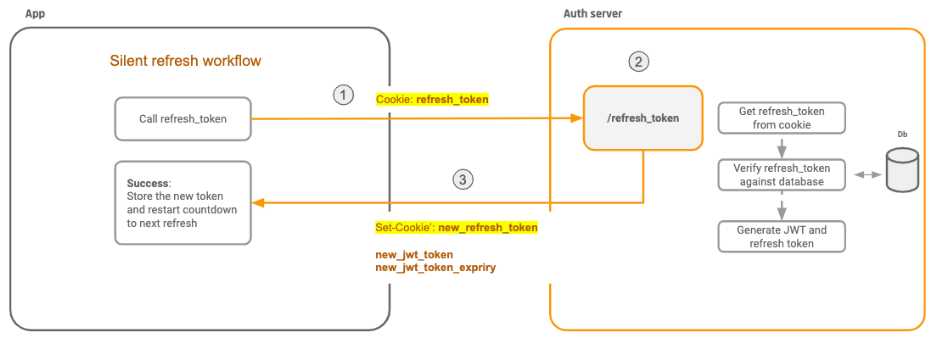
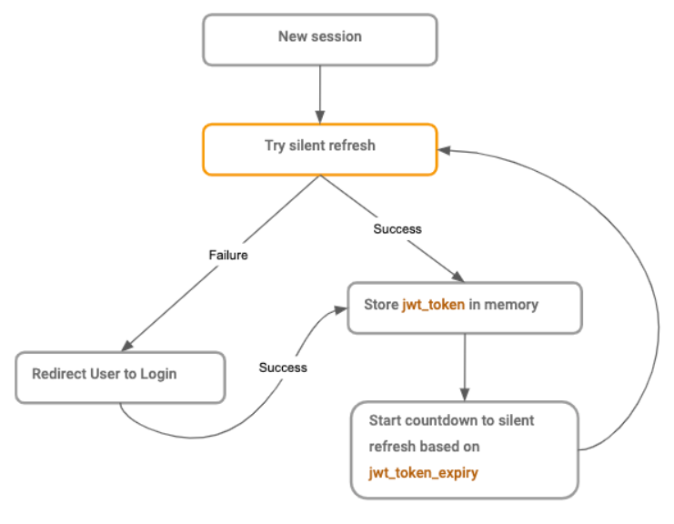

# React Demo Application
Inspired by the idea of a "suspended" coffee, where a cup of coffee paid for in advance as an anonymous act of charity, this React demo application prodives a UI to two C# back-end services, which, together, allow restaurants to record how many suspended servings they have available - in other words, the goal of the application is to facilitate restaurant owners advertising that they have a number of free meals, and to facilitate those in need of the free meals searching for participating restaurants.

# The Architecture
There are three applications: CommunityWebApp, SignOn service and Restaurant service.

## CommunityWebApp
The CommunityWebApp application is the React-based UI.

## SignOn
The SignOn service is responsible for:
* signing-up with just an email address and password, and returning a JWT 
* signing-in with the email address and password, and returning a JWT
* refreshing the JWT (more on that later)
* signing-out by invalidating future refreshes of the JWT (more on that later also)

In theory, this service could easily be replaced by a federated sign-on service, such as Google or Facebook. 

## Restaurant
The Restaurant service is responsible for managing participating restaurants, by:
* adding a restaurant (only the business owner role, authorized by JWT)
* removing a restaurant (only the business owner role who added the restaurant, authorized by JWT)
* updating the number of available free servings (only the business owner role who added the restaurant, authorized by JWT)
* verifying the restaurant exists and is owned by the restaurant owner (only the admin role, authorized by JWT)

# JWT and JWT Refresh
The React application and the back-end services are fairly self-explanatory. They are all part of a VS Solution, so when you run them together, you can navigate through the UI to understand the flow.

However, the JWT refresh process is worth explaining. The explanation, and the implementation, is based on https://hasura.io/blog/best-practices-of-using-jwt-with-graphq

## What is a JWT?
For the purposes of authorization and authentication, a JSON Web Token (JWT) is a token that is issued by the auth server. The token has a JSON payload that contains information specific to the user, such as name, email address, or user role. This token can be used by clients when talking to APIs (by sending it along as an HTTP header) so that the APIs can identify the user represented by the token, and take user specific action.

The JWT also contains a signature, created by the server that issued the token (e.g. the SignOn server) and any other server that receives this token can independently verify the signature to ensure that the JSON payload was not tampered with, and thus has information that was issued by a legitimate source.

In this demo's architecture, the React application, CommunityWebApp, retrieves a JWT from the SignOn service (assuming the username and password are correct), which is subsequently sent to the Restaurant service with each call to its API, so the Restaurant service can confirm the user's identity and role.

### JWT Expiry
If a JWT is stolen, then the thief can can keep using the JWT. An API that accepts JWTs does an independent verification without depending on the JWT source, so the API server has no way of knowing if this was a stolen token. Therefore, JWTs have a short expiry time, commonly around 15 minutes.

Therefore, it’s important not to store a JWT on the client, say via cookies or localstorage. Doing so you make your application vulnerable to CSRF & XSS attacks, by malicious forms or scripts looking for tokens in cookies or localstorage. For client-side applications that require auth, such as the React app CommunityWebApp, the JWT should be stored by the application.

This makes logging out of the application easy - you just have to delete the record of the JWT from memory: if you don't have a JWT in memory, you can't access the back-end APIs (the ones that require auth). It's worth noting that any application that's running on the client side only knows about authentication as a courtesy - no back-end service should trust the client-side application if it says the user has been authenticated, as the client-side application can be manipulated by the client.

## JWT Refresh
To avoid a user being logged out every 15 minutes and to facilitate sessions persisting across multiple tabs and across sessions (browser being closed and opened), JWT refresh tokens are used.

JWT refresh tokens are used to fetch a new JWT from the SignOn server and they can be safely persisted across sessions on the client.

### How do refresh tokens work?
When a JWT is issued by the SignOn server, at sign-in, the SignOn server also issues a refresh token and saves a copy of the token locally.

The refresh token is issued by the auth server to the client as an HttpOnly cookie. When the client calls the refresh end-point of the SignOn server (to get a new JWT), the refresh token is sent by the browser in the HttpOnly cookie. If the refresh token in the cookie matches the record on the SignOn server, a new JWT is issued.

The HttpOnly cookie cannot be read by client side Javascript, so can't be stolen that way, which makes it a little better at mitigating XSS than persisting it as a normal cookie or in localstorage, and it's safe from CSRF attacks, because even though a form submit attack can make an API call to refresh the JWT, the attacker cannot get the new JWT token value that is returned.

### In Pictures
Silent Refresh Workflow

* Call /refresh_token endpoint
* Server will read HttpOnly cookie and if it finds a valid refresh token, then
* the server returns a new JWT and JWT expiry time to the client and also sets a new refresh token cookie via Set-Cookie header.

## Persisting Sessions
Now we can use the refresh token, saved in the HttpOnly cookie, we can persist sessions. When the application loads for the first time, no JWT is saved in memory, so the user is not "logged in". The first thing we do at application start-up is make a call to the SignOn server's refresh API - if we have a valid cookie, we will be returned a JWT.

Therefore, a session will persist for as long as the refresh token cookie is valid.

## Logging Out
Now that we automatically log in at application start up and because we cannot remove the HttpOnly cookie from the client side, it has become impossible to log out as long as the refresh token is valid and the refresh token cookie is valid. Therefore, we need to make a call to the SignOn server to invalidate the refresh token. A simple call to the SignOn server that causes the server to replace the refresh token with a new one, which isn't sent back to the client via the cookie, is enough to force logout. Next time a refresh request is made, the token would be invalid. 

## Logging Out (and In) on Different Tabs
Users expect that if they are logged out on one tab in a browser, they should be logged out on all tabs - and vice versa.

One way of solving this is by introducing a global event listener on localstorage. Whenever we update this logout key in localstorage on one tab, the listener will fire on the other tabs and trigger a "log out" too and redirect users to the login screen.
